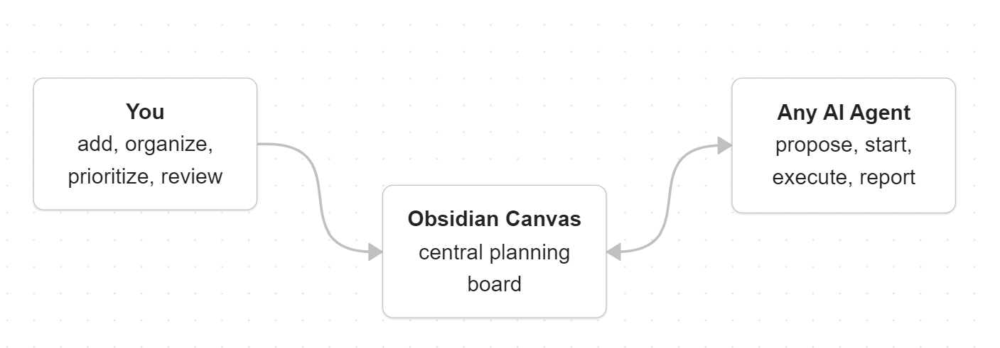
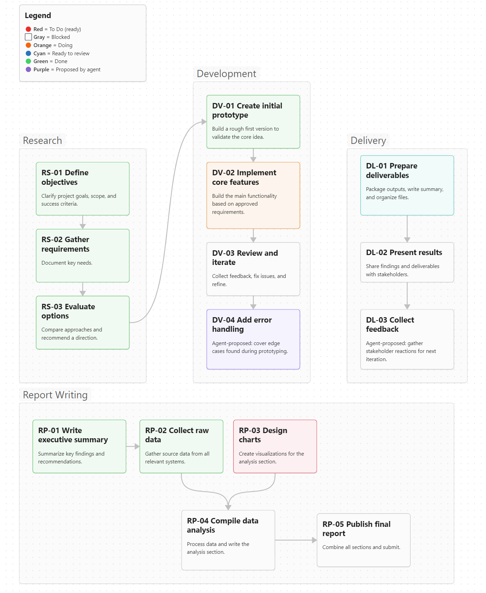

# Kanvas

Plan, track, and coordinate projects between humans and AI agents on an [Obsidian](https://obsidian.md) Canvas board.



---

## Why This Exists

AI agents work best in their CLI sandboxes — that's what companies optimize their RL training for. But you still need to **plan the project**, break it into tasks, see what depends on what, and track progress as you and your agents work through it.

Kanvas gives you a visual project board in Obsidian Canvas where you lay out the plan, and agents interact with it through a CLI tool.

**The goals:**

- **Both sides contribute.** You add tasks, set priorities, draw dependencies. Agents propose tasks, do work, report back. The board is a shared space, not a one-way instruction sheet.
- **Agent-agnostic.** Works with Claude Code, Codex, Gemini CLI, or anything that can run a shell command. Switch agents mid-project, use multiple at once — the board doesn't care.
- **Git-friendly.** `.canvas` files are JSON. They diff, merge, and version like any other file in your repo.
- **Low setup cost.** Obsidian + one Python file with no dependencies. Copy an instruction file to your project root and go. Optional Obsidian plugin adds dependency checks and automations.
- **Flexible.** Some tasks are for agents, some are for you (hardware, design, manual testing). Same board, same colors, same flow.

Obsidian Canvas already gives you cards, groups, arrows, and colors. Kanvas adds a workflow on top: color-coded task states, dependency tracking, and a CLI that keeps agents from breaking the rules.


### What's in this project

1. **The workflow prompt** (`RULES.md`) — the core. Defines task states, dependencies, and what agents can and cannot do. Copy the agent instructions (`CLAUDE.md` / `AGENTS.md`) into your project and any LLM can follow it.

2. **The CLI tool** (`canvas-tool.py`) — keeps agents honest. Enforces valid transitions, dependency checks, and blocked states instead of letting agents edit `.canvas` JSON directly. Python 3.7+, zero dependencies.

3. **The Canvas Watcher plugin** (optional) — lints the board when *you* edit it in Obsidian. Auto-manages blocked states, catches circular deps, flags warnings. Not required.

---

## How It Works

Cards have colors. Colors are states. Arrows are dependencies.

| Color  | State | Who moves it |
|--------|-------|-------------|
| 🟣 Purple | Proposed | Agent |
| 🔴 Red | To Do | Human |
| 🟠 Orange | Doing | Agent or Human |
| 🔵 Cyan | Review | Agent |
| 🟢 Green | Done | Human |
| ⬜ Gray | Blocked | Automatic |

```
Propose → Purple → Approve → Red → Start → Orange → Finish → Cyan → Verify → Green
```

If a task depends on something that isn't green yet, it's gray (blocked). When the dependency is done, it flips to red automatically.

### Example project board


---

## Getting Started

**Requirements:** Python 3.7+, Obsidian.

### Setup

Drop these files into your project repo:

1. **`canvas-tool.py`** — the CLI tool
2. **`CLAUDE.md`** / **`AGENTS.md`** — agent instructions (pick one for your platform)
3. **A `.canvas` file** — copy `examples/blank.canvas` as a starting point, or `examples/sample-project.canvas` to see a full example

| Platform | Instruction file |
|----------|---------|
| Claude Code | `CLAUDE.md` in project root |
| Codex | `AGENTS.md` in project root |
| Gemini CLI | `AGENTS.md` renamed to `GEMINI.md` |
| Others | Paste `AGENTS.md` content into your agent's system prompt |

### Recommended workflow

1. **Plan first.** Open the `.canvas` in Obsidian. Add tasks yourself, or ask your agent to interview you about the project and propose a plan using `batch`. Spend time here — a good plan saves time later.

2. **Review the board.** Approve proposals (purple → red), rearrange, add dependencies by drawing arrows. Get the canvas looking right before you start executing.

3. **Execute with your agent.** The agent picks a red task, works on it, marks it for review. You verify and mark it green.

4. **Commit per task.** After each task is done, commit the code *and* the `.canvas` file together. Your git history mirrors the project plan — you can check out any commit and see the board state at that point.

5. **Repeat.** As tasks complete, blocked ones unlock. The board evolves as the project progresses.

---

## CLI Reference

```
python canvas-tool.py "<file>.canvas" <command> [args]
```

**Read:**

| Command | Description |
|---------|-------------|
| `status` | Board overview |
| `show <ID>` | Task detail with dependencies |
| `list [STATE\|GROUP]` | Filter by state or group |
| `ready` | Red tasks with all deps met |
| `blocked` | Gray tasks and what blocks them |
| `blocking` | Tasks that block others |
| `dump` | Raw JSON |

**Work:**

| Command | Transition |
|---------|-----------|
| `start <ID>` | Red → Orange |
| `finish <ID>` | Orange → Cyan |
| `pause <ID>` | Orange → Red |
| `edit <ID> "<text>"` | Update description (orange only) |

**Add:**

| Command | Description |
|---------|-------------|
| `propose <GROUP> "<TITLE>" "<DESC>" [--depends-on ID ...]` | New task (purple) |
| `propose-group "<LABEL>"` | New group |
| `batch` | Bulk-add from JSON on stdin |
| `add-dep <FROM> <TO>` | New dependency edge |
| `normalize` | Assign IDs, fix blocked states |

No delete, no done, no raw JSON editing — by design.

---

## Optional: Canvas Watcher Plugin

Lints the board when you edit it in Obsidian. Updates blocked states, catches circular deps, flags warnings on save. Not required — the CLI handles the agent side independently.

```bash
node canvas-watcher-plugin/install.js    # install into Obsidian
# then enable in Settings → Community plugins → Canvas Watcher
```

Or run standalone: `node canvas-watcher.js` (watch mode) or `node canvas-watcher.js "Project.canvas"` (one-shot).

---

## Project Structure

```
kanvas/
├── canvas-tool.py             # CLI tool (Python 3.7+, zero deps)
├── RULES.md                   # Full workflow protocol
├── CLAUDE.md                  # Agent instructions (Claude Code)
├── AGENTS.md                  # Agent instructions (Codex / Gemini / others)
├── canvas-watcher.js          # Watcher/linter (optional, Node.js)
├── canvas-watcher-plugin/     # Obsidian plugin (optional)
└── examples/
    ├── blank.canvas           # Empty template with legend
    └── sample-project.canvas  # Example board
```

Full protocol docs: [RULES.md](RULES.md)

## License

MIT
